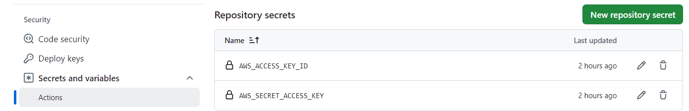

# Web Service development with SpringBoot, Swagger, AWS ECS EC2, Terraform, GitHub Workflow

## Overview

This guide describes a way to deploy web services in a AWS ECS Cluster on EC2. The sample service built with SpringBoot with JPA, Swagger to test the web service, MYSQL Database for data storage, GitHub workflow, Terraform for AWS resource provisioning and deployment, and GitHub workflow. The purpose of this article is to showcase a way to assemble all components to deploy a scalable web service in ECS Cluster on EC2 instances.

### Frameworks
 - SpringBoot popular choice for Java developers
 - Swagger enables Top-down approach, or design-first
 - Terraform enables ease of Cloud deployment
 - GitHub workflow enables to develop CI/CD pipelines from packing to deploying


### Architecture


- Note: To avoid NAT gateway cost, the services deployed in public subnet instead of private subnet.

### Final outcome
- Web Service Swagger UI

- api-docs - http://server:port/context-path/v3/api-docs.yaml
- API Document - http://server:port/context-path/v3/api-docs.yaml

### Web Service functionality
 - Services to manage users
 - Services to manage reviews

### Resources created with Terraform:
 - VPC with public & Private subnets
 - Internet Gateway to connect to the global Internet from public subnet
 - Security groups for EC2 Node & ECS Service
 - Auto-scaling group for ECS cluster using EC2
 - Installing the image to ECR
 - ECS cluster with task and service definition
 - Load Balancer to public access & scale ECS Service

### GitHub workflow handles
 - Code checkout on events
 - Prepare Maven builds
 - Custom tag each build with code check-in hash and the time stamp
 - Login to Amazon ECR
 - Publish image to ECR


#### GitHub workflow (CI/CD ECS EC2 Deployment.yaml)
 

#### GitHub pipeline 
 

## Preparation

Two options to deploy 
  -- Docker desktop
  -- AWS ECS with containers running on EC2. (Note: With slight changes can be deployed to FARGATE and EKS)

### Git Hub Secrets and Variables

 - Setup the secrets to login to AWS account
    
 
 - Application variables
    

### Deploying docker desktop
- Update variables used in docker-compose.yml in file - user-reviews.env 

#### Run Docker commands
- Build Docker image               : ``docker build -t sjala/user-reviews:1.0 .``
- Push docker image to Docker Hub  : ``docker push sjala/user-reviews:1.0``
- Deploy in docker desktop 		   : ``docker compose --env-file=user-reviews.env up -d --scale user-reviews=3``

### Deploying to AWS

#### Configuring AWS CLI
 - Configure AWS CLI
     - ``$ aws configure``
     - ``AWS Access Key ID [None]: <enter-access-key-id>``
     - ``AWS Secret Access Key [None]: <enter-access-key>``

#### How to use
 - Clone the GitRpo
 - Create ECR Repo
 - Update the Terraform variables (#### Terraform variables)
 - Run the GitHub workflow to prepare image in your AWS ECR
 - Provision AWS Resources and deploy (### Provision AWS resource using Terraform)
 - Access Web Service at Terraform output : {alb_url}

#### Terraform variables
 - Following variables in variables.tf can be modified as needed
     - environment        : environment tag
     - AWS Region         : AWS_REGION
     - key_name           : AWS Key pair
     - aws_ecr_app_image  : Image Id from ECR registry. it has both the registry and image version 
       - Ex       : AWS_ACCCOUNT_ID.dkr.ecr.AWS_REGION.amazonaws.com/sjala/user-reviews:622d47c-2024-10-16-19-08
       - ECR      : AWS_ACCCOUNT_ID.dkr.ecr.AWS_REGION.amazonaws.com
          <a href="docs/AWS_ECR.jpg">
       - Image Id : sjala/user-reviews:622d47c-2024-10-16-19-08
          <a href="docs/AWS_ECR_image.jpg">
     - database_username  : MySQL DB User name 
     - database_password  : MYSQL DB Uer password 
       - (Note: Please use the system environment variables or secret stores DB credentials)
    

#### GitHub Details

- Workflow can be customized : <a href="https://github.com/sriharijala/spring_ecs_ec2_swagger/blob/main/.github/workflows/CI_CD_ECS_EC2_Deploment.yaml">CI/CD ECS EC2 Deployment</a>

- GitHub project: <a href="https://github.com/sriharijala/spring_ecs_ec2_swagger">spring_ecs_ec2_swagger</a>

- Branches to build:
      Branch Specifier: */main 

### Provision AWS resource using Terraform 
 - Change to directory iac/ecs_ecs 
 - Intialize Terraform                      
     ```terraform init```

 - Run the Terraform plan             
     ```terraform plan```

 - Run apply the Terraform with auto approve
     ```terraform apply --auto-approve=true```

 - Run to dismantle the AWS infrastructure     
     ```terraform destroy --auto-approve=true```

#### Outputs from Terraform
 - The ALB load balancer URL and mysql Database URL.
 - alb_url = ex: "user-reviews-alb-1057870179.us-east-1.elb.amazonaws.com"
 - mysql_db_url = ex: "socialmedia.cbigw6wa0drf.us-east-1.rds.amazonaws.com:3306"
 - mysql_host = ex: "socialmedia.cbigw6wa0drf.us-east-1.rds.amazonaws.com"


## End point URLS
- Swagger end point URL from Terraform output : {alb_url}

## Helpful commands

### Terraform commands
- Initialize terraform                           : ``terraform init``
- Execute the plan                              : ``terraform plan``
- Create the infrastructure with auto approve     : ``terraform plan --auto-approve=true``
- Get teh private key to ssh to ec2BationKey     : ``terraform output -raw ec2BationKey``
- Remove the entire infrastructure auto approve   : ``terraform destroy --auto-approve=true``
- List all resources crated                      : ``terraform state list``
- Remove selective resource                       : ``terraform destroy --target resource_name --auto-approve=true``

### Terraform Knowledge base
- <a href="https://registry.terraform.io/providers/hashicorp/aws/latest/docs/resources/ecs_task_definition">How to define multiple services in task definition</a> 


### Push Docker image to ECR

#### Login to AWS ECR
##### Note : In case Windows, use set REPO=aws_ecr_repo_url and reference variable with %REPO%
##### Create a repo in ECR and get AWS repo url from aws
    ``export REPO=aws_ecr_repo_url``
    ``aws ecr get-login-password | docker login --username AWS --password-stdin $REPO``
    
##### Pull docker image & push to our ECR
    ``aws ecr get-login-password --region us-east-1 | docker login --username AWS --password-stdin``
    ``docker tag sjala/user-reviews:latest $REPO/sjala/user-reviews:latest``
    ``docker push $REPO:latest``

##### SSH into Docker container
  - List the containers running on the system: 
         ```docker ps```
  - Find the container's IP address with the following docker inspect command:
         ```docker inspect -f "{{ .NetworkSettings.IPAddress }}" [container-name-or-id]```

   
### Amazon Linux commands
 - sudo yum -y install telnet
 - sudo yum -y install mysql

### ECS Clusters Commands
- List ECS Clusters: aws ecs list-clusters
- List LCuster Services:  aws ecs list-services --cluster "arn:aws:ecs:us-east-1:{ACOOUNT_ID}:cluster/user-reviews"
- List tasks: aws ecs list-tasks --cluster user-reviews
- Login to container: aws ecs execute-command --cluster cluster-name --task task-id --container container-name --interactive --command "/bin/bash"

### MySQL
 - Login to MySQL from EC2 Instance : mysql -usjala -pJalaJala123 -hsocialmedia.cbigw6wa0drf.us-east-1.rds.amazonaws.com -P3306
 - Change schema: use schema name
 - List all users: select User,Host from mysql.user;
 - Grant access to user from any host: ```GRANT ALL PRIVILEGES ON *.* TO 'USERNAME'@'%' IDENTIFIED BY 'PASSWORD' WITH GRANT OPTION;```

### AWS Commands
aws ecs execute-command --cluster review-cluster --task 77063c453c9c4feb89b085a1a6988b28 --container review-app --interactive --command "/bin/bash"

### Reference Documentation
For further reference, please consider the following sections:

* [Official Apache Maven documentation](https://maven.apache.org/guides/index.html)
* [Spring Boot Maven Plugin Reference Guide](https://docs.spring.io/spring-boot/3.3.2/maven-plugin)
* [Create an OCI image](https://docs.spring.io/spring-boot/3.3.2/maven-plugin/build-image.html)
* [Spring Web](https://docs.spring.io/spring-boot/docs/3.3.2/reference/htmlsingle/index.html#web)
* [Spring Data JPA](https://docs.spring.io/spring-boot/docs/3.3.2/reference/htmlsingle/index.html#data.sql.jpa-and-spring-data)

### Guides
The following guides illustrate how to use some features concretely:

* [Building a RESTful Web Service](https://spring.io/guides/gs/rest-service/)
* [Serving Web Content with Spring MVC](https://spring.io/guides/gs/serving-web-content/)
* [Building REST services with Spring](https://spring.io/guides/tutorials/rest/)
* [Accessing Data with JPA](https://spring.io/guides/gs/accessing-data-jpa/)
* [Accessing data with MySQL](https://spring.io/guides/gs/accessing-data-mysql/)
